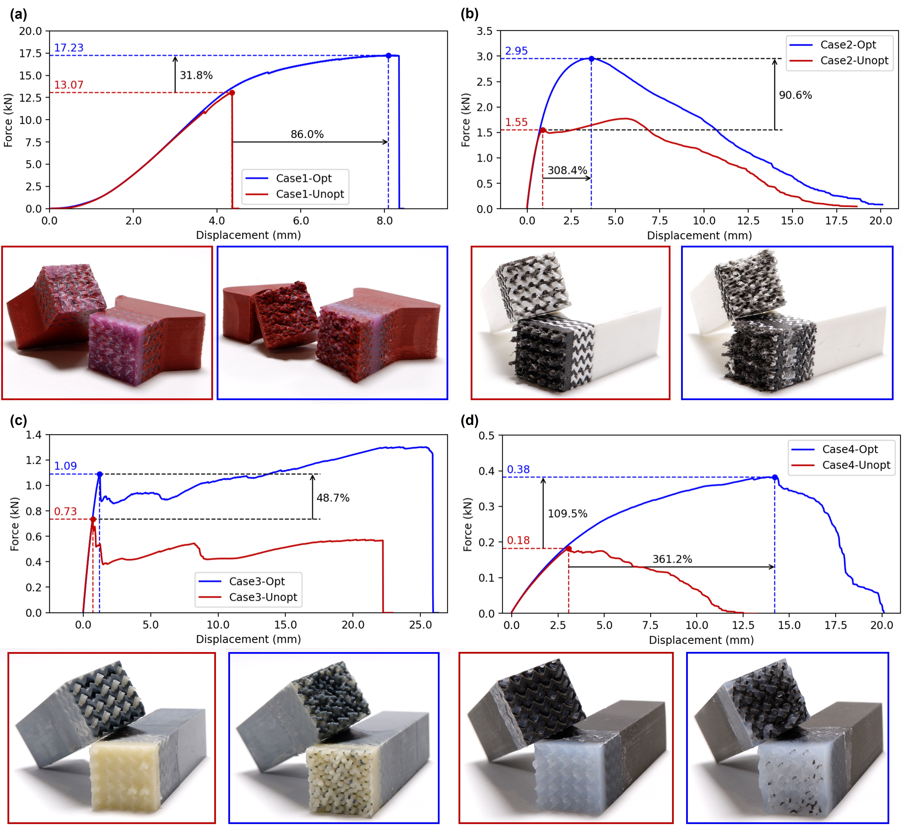
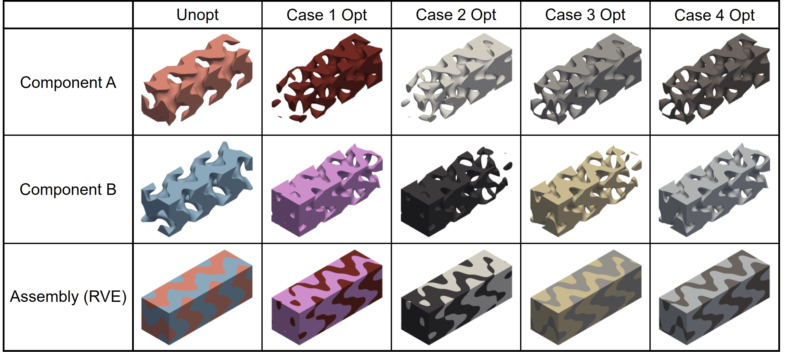

# Mechanical-Bonding-Structure


## Abstract
The mechanical interlocking structures can effectively bond disparate materials that have very weak chemical bonds. Existing approaches adopted structures with limited variation in geometry and topology, which prevent the exploration of mechanical bonding structures with optimal performance. The Representative Volume Element (RVE) modeling approach of Finite Element Method (FEM) is often employed to study the mechanical strength of periodic structures with complicated geometry and topology. However, existing RVE-FEM tools have challenges in handling non-periodic mesh and partial periodicity,limiting the ability to analyze and optimize such interlocking structures for mechanical bonding. This paper presents a formulation based on Triply Periodic Minimal Surface (TPMS) with hybrid basis functions to explore the design space of interlocking structures, where the structure is optimized by a datadriven method based on surrogate-model fitting. This is enabled by developing a new tool to apply Periodic Boundary Conditions (PBC) to RVE-FEM. The effectiveness of our approach in optimizing interlocking structures has been validated through mechanical tests on physical models, combining 3D-printed components with molded materials like silicone that are challenging to print directly.
## Installation
Platform: Windows 11 + Python 3.9

Before using our code, please install Abaqus2020.

### Python Code
We suggest using Anaconda as the virtual environment.
```
git clone https://github.com/LewiSMY/Mechanical-Bonding-Structure
cd Mechanical-Bonding-Structure
conda create -n MBS python=3.9
conda activate MBS
pip install pip install pandas numpy skopt pyvista tetgen 
```

optional for download results automatically
```
pip install gdown tarfile 
```

# Usage
Jump to src folder
```
cd src
```
and run code
```
python TPMS11_Main.py
```

# Results
Results can be found [google drive](https://drive.google.com/drive/folders/14tUD6OP2ZKzp_M64qTQty5Ov2nFCco_v?usp=drive_link) or run following command
```
python results.py
```




## Reference
+ will add soon

## Contact Information
Renbo Su     (renbo.su@postgrad.manchester.ac.uk)

Tao Liu      (tao.liu@manchester.ac.uk)

Charlie C.L. Wang (changling.wang@manchester.ac.uk)
